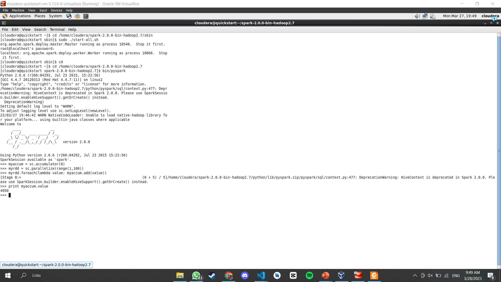

# Hasil
# Accumulator

# BroadCast

# PairRDD

# SystemCommandsOutput

# SystemCommandsReturnCode

# UnderstandingRDDs

# WordCount

##### Komang Gede Narariya Suputra
##### 2041720225
##### TI3B
##### 10
