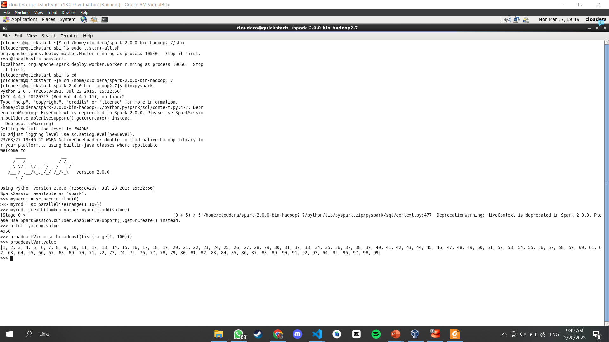
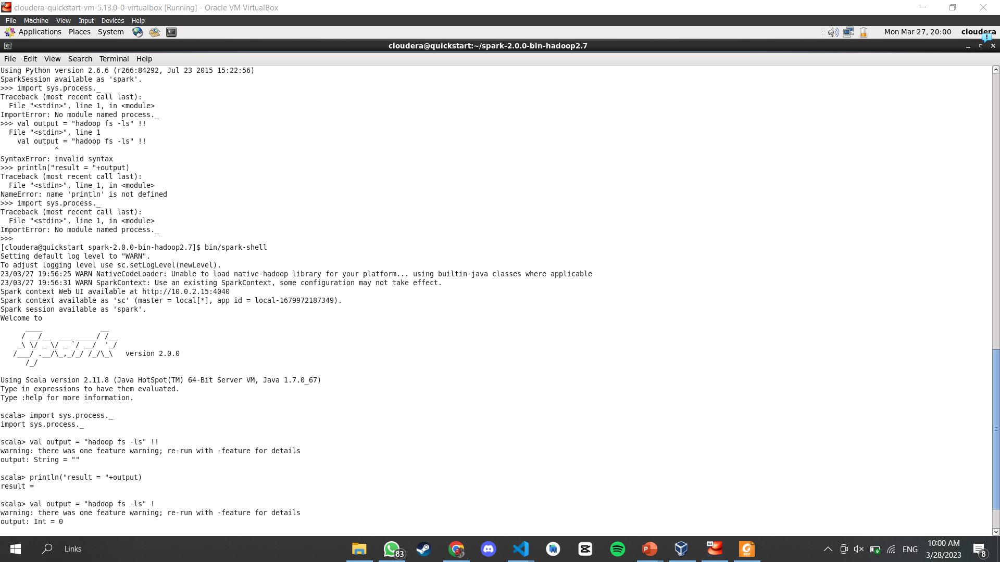

# Jelaskan masing-masing maksud kode berikut sesuai nomor kode.

1. Kode 1 - sc: singkatan dari SparkContext, objek utama untuk berinteraksi dengan Spark dalam lingkungan Python atau Scala.
- accumulator: objek di Spark yang dapat diakses secara paralel dan dapat digunakan untuk menjalankan operasi agregasi seperti penghitungan jumlah atau rata-rata dalam lingkungan yang terdistribusi.
- parallelize: metode pada objek SparkContext yang mengubah koleksi objek menjadi RDD (Resilient Distributed Datasets) yang terdistribusi secara paralel di beberapa node dalam kluster Spark.
- lambda: fungsi anonim dalam Python yang digunakan untuk operasi pemetaan atau filtering pada data RDD. 
- value: metode yang digunakan untuk mengembalikan nilai dalam variabel yang diakses secara bersamaan dalam lingkungan yang terdistribusi.

2. Kode 2 - broadcast: mekanisme dalam Spark untuk mengirim data besar ke setiap node dalam kluster tanpa mengulanginya untuk setiap tugas pemrosesan.
- list: struktur data dalam Python yang digunakan untuk menyimpan kumpulan elemen yang terurut dan dapat diakses dengan indeks.
- range: fungsi dalam Python yang menghasilkan urutan angka dalam rentang tertentu.

3.  Kode 3 textFile: metode pada objek SparkContext yang digunakan untuk membaca file teks dalam RDD.
- filter: metode pada RDD yang digunakan untuk memfilter elemen dengan kriteria tertentu.
- cache: metode pada RDD yang digunakan untuk menyimpan RDD di memori untuk akses yang lebih cepat.
- count: metode pada RDD yang mengembalikan jumlah elemen dalam RDD.

4. Kode 4 - map: metode pada RDD yang digunakan untuk melakukan operasi pemetaan pada setiap elemen dalam RDD.
- collect: metode pada RDD yang mengembalikan semua elemen RDD ke driver program.
- len: fungsi dalam Python yang mengembalikan jumlah elemen dalam struktur data.
- keys: metode pada RDD yang mengembalikan kunci dari setiap pasangan kunci-nilai dalam RDD.
- values: metode pada RDD yang mengembalikan nilai dari setiap pasangan kunci-nilai dalam RDD.

5. Kode 5 defaultParallelism: konfigurasi pada Spark yang menentukan jumlah partisi RDD secara default.
- getNumPartitions: metode pada RDD yang mengembalikan jumlah partisi RDD.
- mapPartitionsWithIndex: metode pada RDD yang digunakan untuk melakukan operasi pemetaan pada setiap partisi RDD dengan indeks partisi yang terkait.
- repartition: metode pada RDD yang digunakan untuk mengubah jumlah partisi RDD menjadi jumlah yang diinginkan.
- coalesce: metode pada RDD yang digunakan untuk menggabungkan beberapa partisi menjadi satu partisi.
- toDebugString: metode pada RDD yang mengembalikan informasi debugging RDD.

6. Kode 6 - flatMap: metode pada RDD yang digunakan untuk melakukan operasi pemetaan dan menghasilkan beberapa keluaran untuk setiap masukan.
- reduceByKey: metode pada RDD yang mengurangi nilai dari pasangan kunci-nilai yang sama dengan operasi tertentu.
- split: metode pada string dalam Python yang memisahkan string menjadi beberapa substring berdasarkan pemisah tertentu.

# Hasil Praktikum
# Accumulator

# BroadCast

# PairRDD

# SystemCommandsOutput

# SystemCommandsReturnCode

# UnderstandingRDDs

# WordCount

##### Komang Gede Narariya Suputra
##### 2041720225
##### TI3B
##### 10
